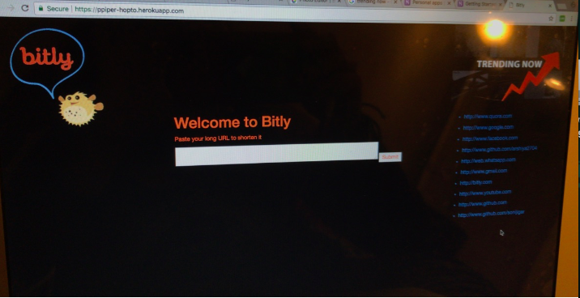

# Bitly_Prototype

Bitly Prototype using technologies:

• Frontend: ejs  
• Backend:  node.js  
• Database: MongoDB 

Features: 

• Encode  
• Decode 
• Trending Server to show top 10 hits 

Steps to run the application:

1. npm install
2. npm start

Below are some screenshots demonstrating the application:

### Welcome Page

